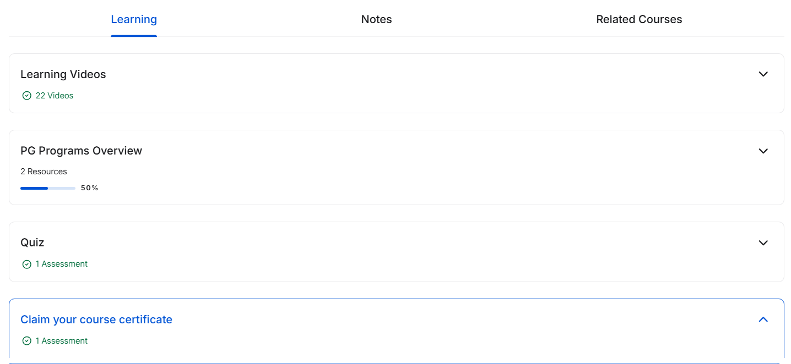

# 📱 Ethical Hacking – Mobile Platforms and Network Architecture - Great Learning

 
 
 
 
  

This repository contains **notes, labs, case studies, threat intelligence mapping, and certificate of completion** for the *Ethical Hacking – Mobile Platforms and Network Architecture* course.  
The course provides deep insights into **mobile OS security, application security, network architecture vulnerabilities, attacks/exploits, and defense strategies**.  

---

## 📚 Notes  

- 📄 [`01-introduction.md`](./notes/01-introduction.md) – Introduction to mobile security  
- 📄 [`02-mobile-os-security.md`](./notes/02-mobile-os-security.md) – Mobile OS security overview  
- 📄 [`03-mobile-application-security.md`](./notes/03-mobile-application-security.md) – Application security risks  
- 📄 [`04-mobile-network-architecture.md`](./notes/04-mobile-network-architecture.md) – Mobile network architecture  
- 📄 [`05-attacks-and-exploits.md`](./notes/05-attacks-and-exploits.md) – Attacks & exploits  
- 📄 [`06-defense-strategies.md`](./notes/06-defense-strategies.md) – Defense & mitigation strategies  
- 📄 [`07-case-studies.md`](./notes/07-case-studies.md) – Real-world case studies  

---

## 🧪 Labs  

- 📲 [`lab-apk-reverse-engineering.md`](./labs/lab-apk-reverse-engineering.md) – APK reverse engineering basics  
- 📡 [`lab-lte-network-analysis.md`](./labs/lab-lte-network-analysis.md) – LTE network security analysis  
- 🌐 [`lab-mobile-traffic-interception.md`](./labs/lab-mobile-traffic-interception.md) – Intercepting & analyzing traffic  
- 📞 [`lab-ss7-vulnerability-testing.md`](./labs/lab-ss7-vulnerability-testing.md) – SS7 protocol vulnerability testing  
- 🔓 [`lab-ssl-pinning-bypass.md`](./labs/lab-ssl-pinning-bypass.md) – SSL pinning bypass  

---

## 📖 Docs  

- 📘 [`glossary.md`](./docs/glossary.md) – Cybersecurity & mobile terms  
- 📘 [`index.md`](./docs/index.md) – Course index  
- 📘 [`references.md`](./docs/references.md) – References & external resources  
- 📘 [`roadmap.md`](./docs/roadmap.md) – Learning roadmap  
- 📘 [`syllabus.md`](./docs/syllabus.md) – Course syllabus  

---

## 📑 Extras  

- 📂 [`case-studies.md`](./extras/case-studies.md) – Additional case studies  
- 📂 [`resources.md`](./extras/resources.md) – Extra resources for practice  
- 📂 [`timeline.md`](./extras/timeline.md) – Timeline of mobile security incidents  

---

## 📸 Screenshots  

| Step                  | Screenshot |
|-----------------------|------------|
| 🏫 Course Learning    |  |

---

## 📜 Certificate  

🎓 [`Ethical Hacking – Mobile Platforms and Network Architecture`](./cert/Ethical%20Hacking%20-%20Mobile%20Platforms%20and%20Network%20Architecture.jpg)  

---

## 📝 Personal Review  

This course strengthened my **knowledge of mobile platforms and their security landscape**.  
I found the **labs on APK reverse engineering, SS7 testing, and SSL pinning bypass** especially valuable for hands-on practice.  
The **network architecture analysis** clarified many real-world vulnerabilities in mobile communication systems.  

Overall, it is an excellent **foundation for anyone exploring mobile security and ethical hacking**.  

---

## ✍️ Author  

**Thành Danh** – Red Team Learner & Security Researcher  

- GitHub: [@ngvuthdanhh](https://github.com/ngvuthdanhh)  
- Email: ngvu.thdanh@gmail.com  

---

## 📄 License  

This project is licensed under the terms of the **MIT License**.  
See [`LICENSE`](./LICENSE) for full details.  

© 2025 ngvuthdanhh. All rights reserved.  
